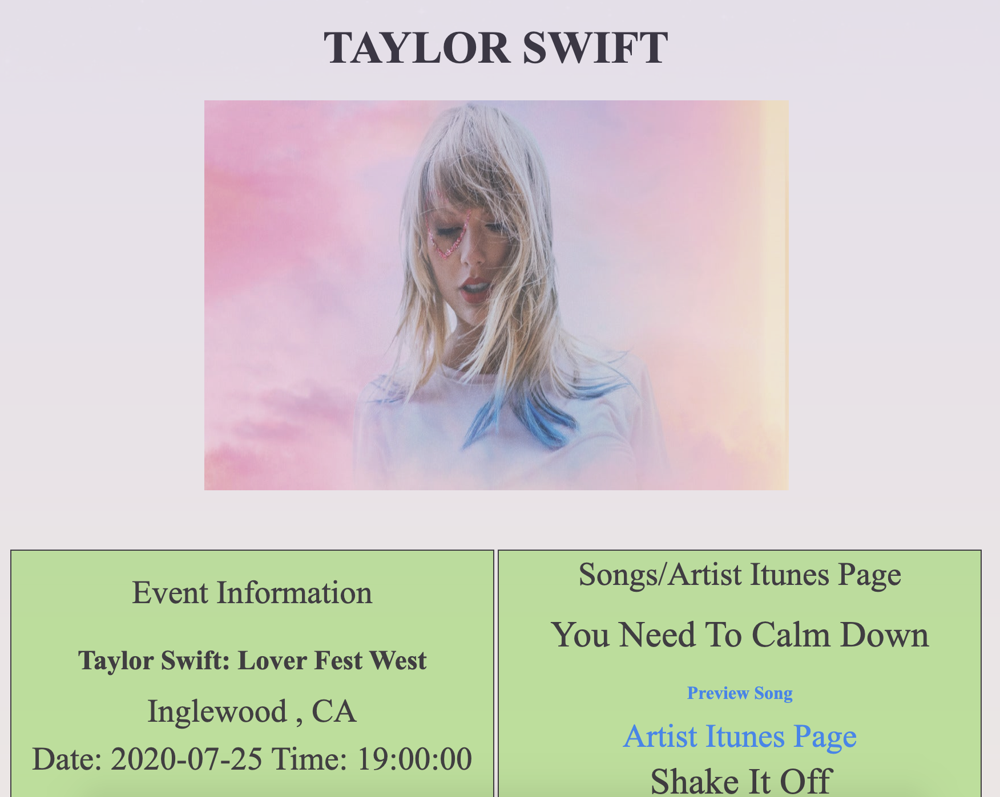

# Artist Discovery!

Link To Deployed Site: https://ericv0801.github.io/groupproj1/ 
## Summary

Artist Discovery, is a front end app created using ticketmaster's API, along with Itunes' Search Api. This web app allows its users to look up an artist and discover their music. A dropdown menu allows users to pick specific dates to look up tours or events that the artist is having within that time frame.

## Instructions

1. Enter an artist in the input field provided.
2. Select a start date and end date if needed.
3. Click the search button.

## Technologies Used

- HTML
- CSS
- Javascript
- JQuery
- APIs – Ticket Master | Itunes Search API
 
 
 

## Authors

- Kin Kam Zhao - https://github.com/kamzh88
- Israel Dembele - https://github.com/israel81boot
- Eric Max Valdivia - https://github.com/Ericv0801

